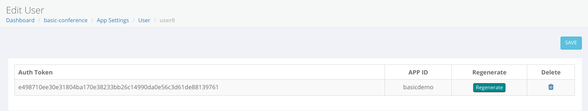
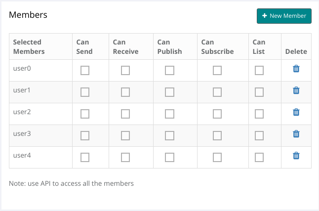

## mesibo basic conferencing demo 
This repository contains the source code for the basic conferencing demo.

The basic conferencing demo will help you get familiar with using mesibo conferencing APIs. For this demo, we will build a conference room up to 5 Participants. Each participant will be able to publish their video, get a list of participants in the conference, and view (subscribe to) other participant's videos. Each participant will able to share their camera feed or share their screen, which will be visible to all the participants. Please note that it is recommended that you use the demo app on a desktop for a better experience.

Once you are familiar with the basic conferencing functionality and the API functions, you can go on to build a full-featured conferencing app with unlimited participants, group messaging, personal chat, etc. - [mesibo Live](https://github.com/mesibo/conferencing/livedemo). You can also try it here [https://mesibo.com/livedemo](https://mesibo.com/livedemo)

### Prerequisites
- This demo uses mesibo Javascript SDK. Ensure that you are familiar with using it.
- Familiarity with mesibo API. Refer [Getting Started Guide](https://mesibo.com/documentation/get-started/) and [First App Tutorial](https://mesibo.com/documentation/tutorials/first-app/#preparation) if you are not familiar.
- Familiarity with mesibo [User and Group Management APIs](https://mesibo.com/documentation/api/backend-api/#group-management-apis)
- A basic understanding of HTML/CSS/JS

### Core features needed for conferencing 

The following are the basic features a conferencing app requires.

1. A conference room which people can join
2. Ability to get the list of participants which is updated as and when people join or leave the room in real-time
3. A participant should be able to publish the video or voice to the room
4. A participant should be able to view video published by other participants
5. Mute/Unmute and other controls
6. Authorization so that only rightful people can join the conference

In the following sections, we will learn how to meet the above requirements.

### Get Source Code

Download the [Source Code](https://github.com/mesibo/conferencing). A recommended way is to clone the repo.

```
$ git clone https://github.com/mesibo/conferencing
```

### UI Elements needed for group calling
This demo will have basic UI elements containing the local video stream, the remote video streams, buttons for muting audio/video streams, a button to share our screen, and exit the group or hangup.

For this demo, we will just have one local video stream and four remote video streams. You can modify accordingly for more users/streams. Refer `room.html`

## 1. Creating a Conference Room

First, create a new application in [mesibo console](https://mesibo.com/console/). 

Click on the `+ CREATE NEW APPLICATION` button under My Applications section in the console. Enter the name of the application `conference` and click `Create`.

In mesibo, the conference room is a group that allows communication between multiple users - that could a video or a voice conference and group chat. Each group contains one or more users who will be participants of this conference call. In a real app, you create users on-demand using mesibo API. However, for this demo, we will create a few users using the mesibo console to quickly understand the concepts.

### Create Users

Once your application is created it will be visible in the `My Applications` table. Click on the Settings icon, to display the `App Settings` page for your app. Click on `Users`. We have five participants needed in our conference, so we need to create five users.

Click on the `+ NEW USER` button. To create a user, Enter a User Address and App ID. 

To create our first user, enter the address as `user0` and the app id as `basicroom`. Then click `Create`. The `user0` should now be displayed in the table. Set `MESIBO_APP_ID` as `basic room` in `demo.js`.  

```javascript
const MESIBO_APP_ID = 'basicroom';
```

Similarly, create four more users with the same App ID `basicroom`. 

You now have five users


Now for a user to login to mesibo, the user needs a token. To get a token for a user, click on the `Edit` icon. Now in the `Edit User` page, copy the `Auth Token`. Replace the `TOKEN_USER_0` with the token you just copied. Replace `ADDRESS_USER_0` with `user0`.



Similarly get the token for other users and configure `demo_users` in the script `demo.js` with the respective token and user address.

```javascript
var demo users = [
    {
     'token' : 'TOKEN_USER_0'
     ,'address'  : 'ADDRESS_USER_0'
     ,'name'    : 'User-0' 
    },

    {
     'token' : 'TOKEN_USER_1'
     ,'address'  : 'ADDRESS_USER_1'
     ,'name'    : 'User-1' 
    },

    {
     'token' : 'TOKEN_USER_2'
     ,'address'  : 'ADDRESS_USER_2'
     ,'name'    : 'User-2' 
    },

    {
     'token' : 'TOKEN_USER_3'
     ,'address'  : 'ADDRESS_USER_3'
     ,'name'    : 'User-3' 
    },

    {
     'token' : 'TOKEN_USER_4'
     ,'address'  : 'ADDRESS_USER_4'
     ,'name'    : 'User-4' 
    },

] 
```
For example, this is how your configuration should look like. 

```javascript
var demo_users = [
    {
     'token' : '6e4a59ab53b82c8edd149ac591a6613'
     ,'address'  : 'user0'
     ,'name'    : 'User-0' 
    },

    {
     'token' : '2d7a9876e9a20847f18cf32dfbea13612f'
     ,'address'  : 'user1'
     ,'name'    : 'User-1' 
    },

    {
     'token' : 'a2a403cd731fd305cb75fe4a00a9e11135d90'
     ,'address'  : 'user2'
     ,'name'    : 'User-2' 
    },

    {
     'token' : 'c5701f652721b8388e0e148a8d722136130'
     ,'address'  : 'user3'
     ,'name'    : 'User-3' 
    },

    {
     'token' : 'a1f65cb75fe4a5288ebf97ab8f18a8d7e22136130'
     ,'address'  : 'user4'
     ,'name'    : 'User-4' 
    },

] 
```

Once you are finished configuring the users, we can now move to create a group and add the users we create as members of the group.

### Create a Group
Go to [mesibo dashboard](https://mesibo.com/console/#/dashboard)and choose the application created earlier(conference) and click on the `Settings` icon. Now click on `Groups` to open the groups page.

To create a new group, click on the `+ NEW GROUP` button. Give a group name - example `ConferenceGroup` and click on `Create`. Your group with the name `ConferenceGroup` should now be created and be displayed in the table. Click on the edit icon, under actions. This will open the Group Settings page.

Now, in the script `demo.js` you need to configure the groupid and group name for the group you just created. Set `DEMO_GROUP_ID` and `DEMO_GROUP_NAME`.

For example, if your groupid is `96191` and group name is `mesibo`
```javascript
const DEMO_GROUP_ID = 96191;
const DEMO_GROUP_NAME = "ConferenceGroup";
```

For the simplicity of our app, we will keep all the settings at default. In our conference room, all the participants will be able to publish live streams and view live streams.


In the members table notice that there are no members/participants and the table is empty. We need to add group members to have users in the conference. 

### Add Members

Now, let us add the users we created earlier as members of this group `ConferenceGroup`. Click on the `+ NEW MEMBER` button and enter the user address, of the user whom you wish to add. In the `User Address` enter `user0` and click on `Add`. The Members table will now display the member you just added. Similarly, add the other four users. 

Refer to [Creating a Group](https://mesibo.com/documentation/api/backend-api/#create-a-group) for more information on creating a group. 

Add the five users created earlier as members of the group.


### Logging-In with the selected user
Before you proceed ensure that you have made the necessary configuration for your group and users.

Open the `room.html` page. There is a button for each user. Click on the user button that you want to login with, which when clicked will select the user and login to mesibo with the token of the selected user.
```javascript
function login(user_index){
    var selected_user = demo_users[user_index];
    
    //Initialize mesibo Group Calling

```

Load the `index.html`  Click on the user button to log in. 

To test the demo, 
1. On one browser window, launch `room.html`. The connection status button will show `Offline`. Click on `User-0`. The connection status button will now show `User-0 is online`. You have now logged in as `User-0`. Your camera feed will automatically connect. Grant required permission for audio and video.
2. Open another browser window and launch `room.html`. Click on `User-1`. The connection status button will now show `User-1 is online`. You have now logged in as `User-1`. Click on the `Share-Screen` button and your screen sharing feed will start. Grant required permissions.
3. You should now see the camera feed of `User-0` being received at `User-1`. The screen feed being sent from `User-1` should be seen at `User-0`. 
4. If you can send and view videos at `User-0` and `User-1`, then you can continue to connect with more users. Similarly, you can open the same web page, `room.html` on different browser windows or devices, and log in as different users, to connect your feed to the group. If you need to test with more users, add more users to the `demo_users` list and modify the UI accordingly. 
5. When you connect with more users, sharing their streams, the grid should look like below:

In the following sections, we will understand how all of this works and how you can use mesibo APIs for conferencing and streaming.


## 2. Getting a list of Participants

Other members, are also mesibo users who are part of the same group(conference room) as you(the publisher). Other group members are also publishing their streams.

Before we get the list of participants, first we need to initialize mesibo and connect to a group.

### Initialize mesibo
To initialize mesibo, create an instance of mesibo API class `mesibo`. Set the app id and token that you obtained while creating the user.
 
You can initialize and run mesibo as follows:
 
```javascript

var api = new mesibo();
api.setAppName(MESIBO_APP_ID);
api.setListener(new mesiboNotify(api));
api.setCredentials(MESIBO_ACCESS_TOKEN);
api.setDatabase("mesibo");
api.start();

```
### Initialize Group Calling & Streaming

To set up group calling and streaming call `initGroupCall()` to create the group call object. 
To link the room with a group, call the `setRoom` method of the group call object, by passing the group-id.

An example in Javascript is as follows,
```javascript
    
//Create group call object
var live = api.initGroupCall();

live.setRoom(DEMO_GROUP_ID);    
```

Now you will get a list of group members through the listener `Mesibo_onParticipants`. You can choose and subscribe to the stream of each member to view it. When a new participant joins the room, `Mesibo_onParticipants` will be called. 

```javascript

mesiboNotify.prototype.Mesibo_OnParticipants = function(all, latest) {    
    for(var i in latest) {
        console.log("Mesibo_Onparticipants: " + latest[i].getId());
        var p = latest[i];
        connectStream(p);
    }
}

```
The parameter `all` contains an array of all participants who have joined.
The parameter `latest` contains the array of participants that have just joined the group.

You can now iterate through the list of participants and subscribe to the stream of each participant.
```javascript
function connectStream(stream){
    for (var i = 0; i < streams.length; i++) {
        if(streams[i] == null){
            streams[i] = stream;
            streams[i].element_id = 'video-remote-'+ i;
            subscribe(streams[i]);
            return;
        }
    }
}
```

### 3. View the streams of participants in the group
You can subscribe to the stream of each participant  that you get in `Mesibo_onParticipants` as follows with the `call()` method
The `call` method takes the following parameters:
- The ID of the HTML element where the video will be rendered
- A callback function `on_stream` where you will be notified of the stream
- A callback function `on_status` where you will be notified when the mute status changes, there is a change in the quality of the stream if the participant has hung up, etc

For example, if the ID of the HTML element where the video will be displayed is `video-stream` then, we can connect to the call as follows:
```javascript
function subscribe(p) {
    console.log('====> subscribe', p.getId(), p.element_id);
    p.call(null, p.element_id, on_stream, on_status);
}


function on_status(p, status, video){
    if(MESIBO_CALLSTATUS_CHANNELUP == status){
        console.log(p.getName()+ 'is connected');
    }
    
    if(MESIBO_CALLSTATUS_COMPLETE == status){
        console.log(p.getName()+ 'has disconnected');
    }
}

function on_stream(p) {
    console.log('on_stream');

    //Local Stream
    if(p.isLocal()) {
        p.attach("video-publisher");
        return;
    }

    //Remote Stream
    console.log('===> on_stream', p.element_id, 'attach');
    p.attach(p.element_id);
}
```

### Publishing your self stream
Call the `getLocalParticipant` method to initialize local publisher(the stream you need to send) 
```javascript

// Create a local participant, Set Publisher name and address
var publisher = live.getLocalParticipant(STREAM_ID, USER_NAME, USER_ADDRESS); 
publish(publisher);
```    
You are the publisher. As a member of the conference room group, you can stream your self, which other members can view.
If the ID of the HTML Element is `video-publisher` then we publish as follows:

Call `streamFromCamera` when you need to send your camera stream.  
Call `streamFromScreen()` when you need to share your stream

```javascript
function streamFromCamera() {
    console.log('streamFromCamera');

    var o = {};
    o.peer = 0;
    o.name = DEMO_GROUP_NAME;
    o.groupid = DEMO_GROUP_ID;
    o.source = STREAM_CAMERA; 

    console.log('local publisher', o);

    publisher.call(o, "video-publisher", on_stream, on_status);
}

function streamFromScreen() {
        console.log('streamFromScreen');
    
    var o = {};
    o.peer = 0;
    o.name = DEMO_GROUP_NAME;
    o.groupid = DEMO_GROUP_ID;
    o.source = STREAM_SCREEN; 

    console.log('local publisher', o);

    publisher.call(o, "video-publisher", on_stream, on_status);
}


```

### Muting Streams

We can mute video and audio locally, for the streams that we are viewing. You can use `toggleMute` method to toggle the audio and video status of a stream. 

```javascript
Stream.toggleMute(video, remote)
```
Parameters:
- `video` Boolean , `true` for video, `false` for audio
- `remote` Boolean, `true` for remote stream, `false` for local stream


For example, to mute audio and video of your own stream-- the publisher
```javascript
function toggleSelfVideo() {
    publisher.toggleMute(true, false);
}

function toggleSelfAudio() {
    publisher.toggleMute(false, false);
}


```
To mute remote stream, you use the same method, but the second parmeter is `false`
```javascript
function toggleRemoteVideo(i) {
    var s = streams[i];
    if(s)
        s.toggleMute(true, false);
}

function toggleRemoteAudio(i) {
    var s = streams[i];
    if(s)
        s.toggleMute(false, false);
}

```

### Getting the Mute Status of a stream

You can get the mute status of a stream with `muteStatus` which has the syntax below:
```javascript
Stream.muteStatus(video,remote)
```
Parameters:
- `video` Boolean , `true` for video, `false` for audio
- `remote` Boolean, `true` for remote source, `false` for local source

Example,
```javascript
    remote.muteStatus(true, false); // video mute status-local source
    remote.muteStatus(false, false); // audio mute status-local source
    
    remote.muteStatus(true, true); // video mute status-remote source
    remote.muteStatus(false, true); // audio mute status-remote source
```
